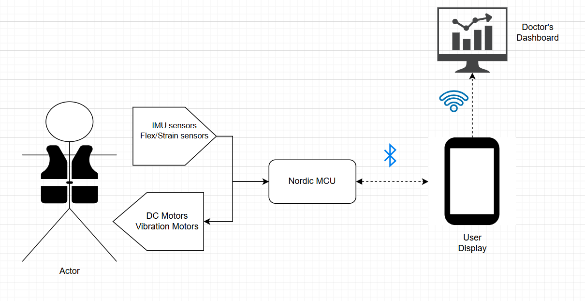
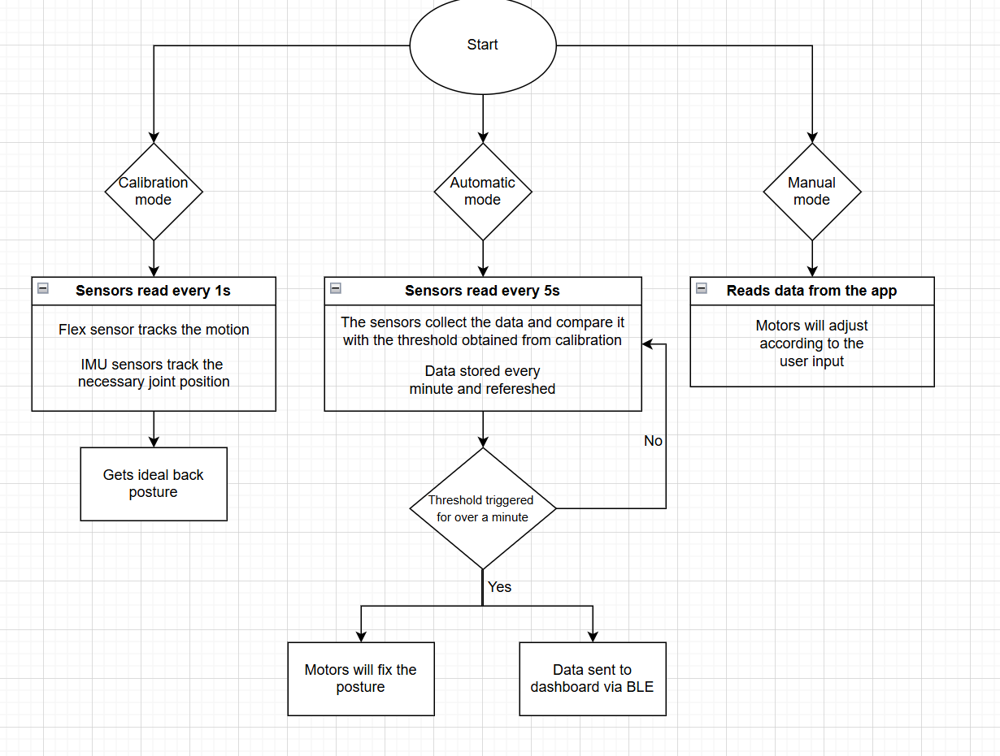

# IoT Venture Pitch

## ESE5180: IoT Wireless, Security, & Scaling

**Team Name: Spam**

| Team Member Name     | Email Address         |
| -------------------- | --------------------- |
| Xiaopeng Jin         | jinxg@seas.upenn.edu  |
| Venkateswara Koduri  | koduri@seas.upenn.edu |
| Siddharth Ramanathan | ramsid@seas.upenn.edu |
| Claren Ogira         | ogira@seas.upenn.edu  |

**GitHub Repository URL:https://github.com/ese5180/iot-venture-f25-spam.git**

## Concept Development

The widespread use of smartphones, laptops, and sedentary lifestyles has led to people spending prolonged periods in unnatural positions. These poor postures can result in chronic back pain, spinal misalignment, muscle fatigue, and long-term health complications. Existing posture correction solutions are either passive (traditional straps) or limited in functionality (simple trackers without real-time correction). There is a need for a smarter, more effective solution that not only alerts users to bad posture but also assists in real-time correction while enabling both personal wellness and clinical rehabilitation.

We propose a smart wearable posture correction strap that integrates advanced sensors and intelligent feedback systems to help users maintain healthy posture habits. Unlike traditional straps, this device incorporates IMU sensors, flex/strain sensors, and vibration feedback modules to continuously monitor spinal alignment.

The device not only detects deviations but also provides real-time corrective feedback through gentle haptic cues and motorized strap adjustments that guide the user back into proper posture.

Users can connect the device to a smartphone application via Bluetooth, where posture data is logged, progress is visualized, and personalized posture improvement goals are set. The same data can be synced to a cloud dashboard for doctors, enabling remote monitoring of patients’ rehabilitation progress.

### Product Function

The smart posture correction device combines advanced sensing, active correction, and therapeutic features to create a holistic solution for both consumers and doctors. It continuously monitors posture using IMU and pressure sensors, automatically recording posture quality, slouch counts, and progress data that can be visualized through daily, weekly, or monthly reports on a smartphone or computer. When bad posture is detected, the device offers active correction through motorized strap adjustments, gently guiding the user back into proper alignment with adjustable sensitivity and calibration options. To prevent prolonged poor posture, it delivers real-time alerts via vibration feedback and customizable smartphone notifications. Additionally, an optional massage mode provides relaxation by delivering gentle vibrations that help relieve muscle stiffness and can even be prescribed by doctors as part of rehabilitation therapy.

Key Functions:

Monitoring & Reports: Automatic tracking, slouch counts, progress visualization.

Active Correction: Motorized strap adjustments, adaptive strength, calibration.

Alerts & Notifications: Vibration reminders, smartphone alerts, customizable thresholds.

Wellness Mode: Massage-like vibration for relaxation and rehab support.

### Target Market & Demographics

1. who will be using our product?
   a. College students who are under the pressure of work
   b. Office workers who need posture support to reduce back or neck strain.
   c. Patients undergoing spinal posture treatment with doctor's recommendation.
2. Who will be purchasing your product?
   a. Individuals purchasing for themselves as a health and productivity aid.
   b.Employers or schools purchasing in bulk for employees/students as part of wellness programs.
   c.Parents buying for their children to prevent hunchback or bad posture.
   d. Rehabilition centres will purchasing in bulk for patients as part of recovery programs.
3. Where in the world would you deploy your product?
   a.Primary market: China US where stress is heavy
   b.Secondary market: US: Where awareness of posture and health is high
4. How large is the market you’re targeting, in US dollars?
   a.The global posture correction and wearable health device market is estimated in the  multi-billion USD range , with CAGR ~7–12% depending on region.
   b.Specifically, posture correction devices alone are projected to exceed  USD 2–3 billion globally within 5 years .
5. How much of that market do you expect to capture, in US dollars?
   a.We will begin by launching pilot programs at the University of Pennsylvania and at selected universities in China, starting with small-scale trials among students.
   b.Based on the trial feedback and gradual adoption, our short-term goal is to validate the product’s effectiveness and generate early revenue.
   c.In the long term, we aim to capture around  0.01% of the global market , which still represents a multi-million USD opportunity given the large market size.
6. What competitors are already in the space?
   a.Traditional posture correction braces (like 背背佳).
   b.Smart wearables like Uprightgo or lumo lift.

### Stakeholders

To better understand the potential impact and usability of our product, we reached out to both consumer and clinical stakeholders. On the consumer side, we spoke with a student from Penn Dental, who confirmed that a posture correction device would be highly useful for daily wellness and prevention of posture-related discomfort. On the medical side, we are in the process of engaging Cody and have initiated outreach to Penn Spinal and Penn Medicine to explore the device’s role in rehabilitation and to validate its use in clinical settings. These stakeholders will help shape the product’s features, ensuring it meets the needs of everyday users while also aligning with medical standards for specialized posture care.

### System-Level Diagrams

The diagram of the system overflowing is shown as 
The diagram of the working diagram is shown as 

### Security Requirements Specification

SEC 01 – User transactions shall provide privacy protection: off-device data must be minimized/pseudonymized so actions are not easily linkable to a person.
SEC 02 – User-identifiable data in transit shall be confidential and integrity-protected to prevent interception or tampering.
SEC 03 – BLE links shall use LE Secure Connections with authenticated bonding; configuration/motor commands require an encrypted, bonded session.
SEC 04 – Wi-Fi / cloud traffic (app ↔ dashboard) shall use TLS 1.2+ (HTTPS) with certificate validation and token-based API authorization.
SEC 05 – The nRF5340 host shall enforce Secure Boot (TF-M) and accept only signed firmware images with rollback to last known-good on verification failure.

### Hardware Requirements Specification

- HRS 01 – Project shall be based on Nordic nRF7002 DK microcontroller.
- HRS 02 – A set of motion sensor shall be used for posture detection.  The sensor shall detect range of motion and calculate the position relative to one another with an accuracy of 5 cm.
- HRS 03 – A set of flex/strain sensors shall also be used for posture detection. The sensors shall be used to detect the range of motion and caliberate the DC motors. The amount of pressure applied while posture correction, can also be measured.
- HRS 04 - A set of vibration sensors shall be used for providing relief during rehabilitation. The vibration motor shall pulse and vibrate to provide stimulation at specific areas.
- HRS05 - A set of DC motors are used for maintating the position of the shoulders and spine.The DC motors control the fabric and help implement the tightness of the fabric control.

### Software Requirements Specification

- SRS 01 – The firmware shall provide three operating modes: Calibration, Automatic, and Manual.
- SRS 02 – The firmware shall run on Zephyr RTOS and integrate the Memfault SDK for remote diagnostics.
- SRS 03 – In Automatic mode, the system shall sample sensors every 5 s and compare results against the stored thresholds.
- SRS 04 – The system shall detect continuous threshold violations over 60 s and then trigger haptic feedback via vibration/DC motors.
- SRS 05 – The mobile app shall receive real-time updates over BLE when the motion in the motors in implemented and forward data to the doctor’s dashboard via a secure internet API.
